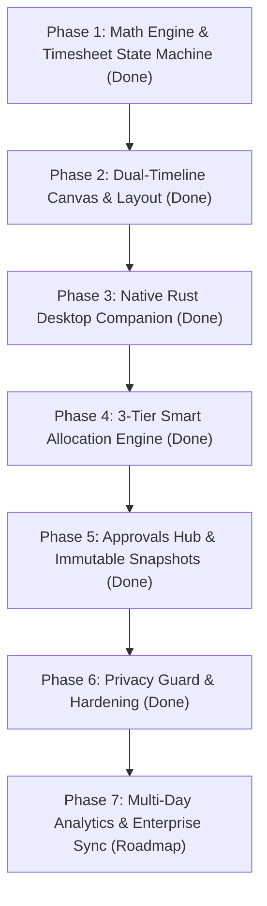

# Implementation Plan & Roadmap: Hourglass

This roadmap outlines the phased development, testing milestones, and architecture execution strategy for **Hourglass**.

---

## Roadmap Overview

---

## Phase 1: Core Mathematical Engine & Timesheet State Machine
- [x] Implement standard consulting tenth-hour (6-minute) ceiling rounding: $\lceil \text{mins}/6 \rceil \times 0.1\text{h}$.
- [x] Implement quarter-hour (15-minute) and exact-minute alternative rounding modes.
- [x] Build decimal hour calculation and deterministic billable revenue formulas ($\text{decimalHours} \times \text{hourlyRate}$).
- [x] Construct timesheet period state machine (`draft` $\rightarrow$ `submitted` $\rightarrow$ `approved` / `rejected`).
- [x] Implement pre-submission audit validator detecting missing project IDs, unbilled gaps, and conflicting overlapping entries.
- **Verification Milestone**: 100% test pass on core mathematical units (`tenth-hour.test.ts`, `timesheet-audit.test.ts`).

---

## Phase 2: Dual-Timeline Canvas & Sub-Lane Collision Layout
- [x] Build synchronized 24-hour interactive canvas (`00:00` to `24:00`) with dynamic vertical scaling.
- [x] Implement left-lane **Memory Aid** visualizing raw OS window focus sessions.
- [x] Develop greedy sub-lane packing algorithm to arrange overlapping raw activities without visual occlusion.
- [x] Implement right-lane **Confirmed Timesheet** with interactive drag-creation and edge resizing.
- [x] Render animated real-time laser line marking the current wall-clock time.
- **Verification Milestone**: Verified collision-free rendering of concurrent tasks and tab deduplication across 1,000+ daily intervals.

---

## Phase 3: Native Rust Desktop Companion & Win32 OS Capture
- [x] Develop standalone Rust desktop daemon in `src-desktop/` compiling to `Hourglass.exe`.
- [x] Implement 1,000ms Win32 `GetForegroundWindow` polling loop.
- [x] Integrate `QueryFullProcessImageNameW` and `VerQueryValueW` PE version resource parser to resolve branded app names (e.g., `EXCEL.EXE` $\rightarrow$ "Microsoft Excel").
- [x] Extract 32-bit DIB taskbar icons via `ExtractIconExW` and `GetDIBits` serialized into base64 PNG data URIs.
- [x] Implement wall-clock jump delta monitor (`clock_skew > 5s`) to detect workstation sleep, locks, and screensavers without accumulating false time.
- [x] Set up local-first SQLite WAL database (`%LOCALAPPDATA%\Hourglass\hourglass.sqlite`).
- [x] Expose local HTTP loopback REST server on `127.0.0.1:3030` (`/activities`, `/status`, `/save`).
- **Verification Milestone**: Successfully captured live desktop foreground activity, verified SQLite WAL writes, and confirmed zero background thread CPU spikes ($< 0.1\%$).

---

## Phase 4: 3-Tier Smart Allocation Engine
- [x] **Tier 1 — Persistent Local Cache (0ms)**: Build O(1) hash lookup matching normalized window titles, document tokens, and app names against past user-confirmed allocations.
- [x] **Tier 2 — Historical Inverted Index (0ms)**: Build tokenized n-gram index matching historical activity logs against client codes and project keywords.
- [x] **Tier 3 — Deduplicated Groq LLM (<300ms)**: Integrate Groq API client (`llama-3.3-70b-versatile` / `llama3-8b-8192`) with batched prompt deduplication.
- [x] Add 1-click batch acceptance for high-confidence suggestions ($\ge 0.85$) and review flags for low-confidence allocations.
- **Verification Milestone**: Instant zero-latency prefill of recurring tasks with $< 300\text{ms}$ cold classification of novel work files.

---

## Phase 5: Approvals Hub, Immutable Snapshots & Export Engine
- [x] Create Approvals Hub view with period selector and summary KPI metrics (total hours, billable ratio, revenue).
- [x] Implement 1-click manager approval workflow.
- [x] Implement immutable `TimesheetSnapshot` freezing finalized entries, rates, clients, and projects.
- [x] Enforce post-approval write lockout on time entries and project definitions.
- [x] Build validated CSV and JSON timesheet export generators for external billing and ERP systems.
- **Verification Milestone**: Verified approval transitions freeze snapshots and prevent post-approval tampering in both UI and state layers.

---

## Phase 6: Privacy Guard, Application Continuity & Production Hardening
- [x] Integrate Win32 `GetWindowDisplayAffinity` privacy guard (`WDA_EXCLUDEFROMCAPTURE` `0x11`, `WDA_MONITOR` `0x01`).
- [x] Implement `LAST_LEGITIMATE_WINDOW` continuity tracking during masked or DRM windows.
- [x] Eliminate obsolete dependencies and boilerplate (Supabase MCP, Pomodoro audio timers).
- [x] Verify all 88 unit and integration tests across 14 Vitest suites pass cleanly.
- [x] Verify TypeScript strict type-checking (`tsc --noEmit`) passes with zero errors.
- [x] Build optimized production Rust release binary (`src-desktop/target/release/Hourglass.exe`) and frontend distribution (`dist/`).
- **Verification Milestone**: Full test suite passes; production binary executes standalone with active privacy filtering.

---

## Phase 7: Roadmap & Ongoing Enhancements
- [ ] **Multi-Monitor Activity Heuristics**: Distinguish between passive secondary-screen displays and active focus targets.
- [ ] **Bi-Directional Calendar Synchronization**: Direct Microsoft 365 and Google Calendar API connectors alongside existing `.ics` support.
- [ ] **Enterprise Billing Connectors**: Direct export integrations with SAP, Workday, QuickBooks, and Clio.

