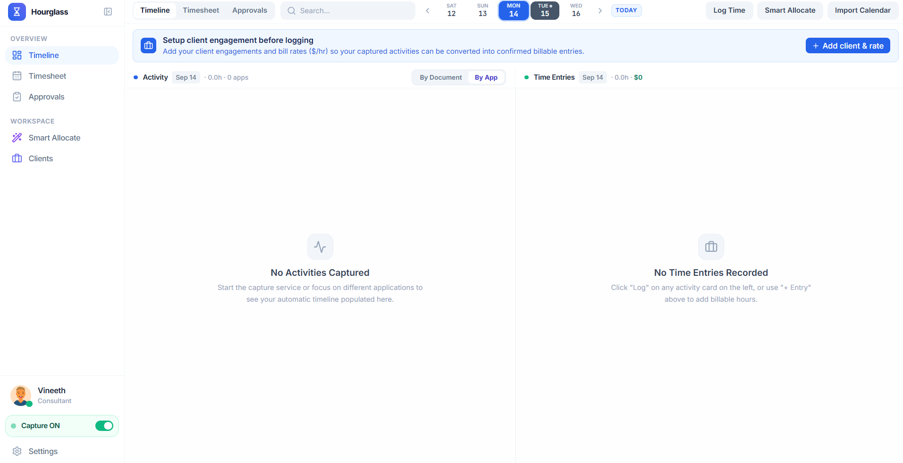

# Hourglass ⏳- Get Back your lost time....

> **A high caliber time track and billable engine built for consultants and boutique advisory firms to get back their lost time.**
> 
> *Includes a native Windows OS capture companion (Rust),timesheet ledger, and Allocation engine.*

---

## 🖥️ Workspace Preview



---


## 🌟 The Business Problem We Solve

Consultants at boutique firms bill their time to clients at \$250–\$400/hour. Today they do it badly:
- Hand-written notes on a phone,
- Spreadsheets rebuilt from scratch every week,
- Hours reconstructed from memory on Friday afternoon.

**Time gets lost, and lost time is lost revenue.** When consultants guess conservative numbers on Friday, 15% to 30% of actual billable work (short client emails, ad-hoc Zoom calls, Excel model tweaks) simply vanishes. For a 10-person firm, that is **over \$300,000 to \$400,000 per year** in unbilled, unrecoverable fees.

Hourglass fixes this by capturing activity passively as consultants work, providing a chronological **Memory**, and bridging raw activity into approved weekly timesheets with an intelligent **Allocation engine**.

---

## 📥 How to Clone & Run on Your Computer

### 1. Prerequisites (All Compulsory)
Ensure your computer has the following installed:
- **Rust & Cargo** (**Compulsory**): Powers the native Win32 OS capture engine, local SQLite WAL persistence, and the embedded HTTP daemon ([Install Rust via rustup.rs](https://rustup.rs)).
- **Node.js** (v18 or higher) & **npm** (**Compulsory**): Powers the React 19 visual workspace, Vite build engine, and test runner ([Download Node.js](https://nodejs.org)).
- **Git** (**Compulsory**): To clone the repository ([Download Git](https://git-scm.com)).

---

### 2. Clone the Repository
Open PowerShell, Command Prompt, or terminal and clone the repository:
```bash
git clone https://github.com/rameshvineeth/Hourglass.git
cd Hourglass
```

---

### 3. Install & Build (Frontend + Rust Engine)

Install the frontend packages and compile both the web workspace and native Rust backend:

```bash
# 1. Install Node dependencies
npm install

# 2. Build the native Rust desktop capture engine (Hourglass.exe)
npm run build:exe

# 3. Build the production React frontend bundle
npm run build
```

---

### 4. Run the Application

#### Option A: Standalone Native Desktop App (`Hourglass.exe`) ⭐ *(Recommended)*
Run the compiled high-performance desktop application:
- **Double-click `Hourglass.exe`** (or `run-hourglass.bat`) in the root directory.
- Or launch via terminal:
  ```powershell
  npm run desktop
  # or directly: .\Hourglass.exe
  ```
Hourglass will:
1. Boot up the local daemon on `http://127.0.0.1:47831`.
2. Activate the Win32 OS background hook for automatic activity capture.
3. Automatically initialize the local SQLite database at `%LOCALAPPDATA%\Hourglass\hourglass.sqlite`.
4. Serve the full, interactive user interface locally.


### 5. Run Automated Unit Tests
Hourglass includes an extensive automated test suite for both frontend logic and native Rust code:

```bash
# Run all 88 Vitest frontend & domain tests
npm test

# Run native Rust capture engine unit tests
npm run test:native
```
The test suite covers:
- 6-minute tenth-hour ceiling calculation math
- Gap & overlap detection
- Timeline greedy collision-free sub-lane packing
- Immutable snapshot preservation & approvals state machine
- 3-tier Smart Allocation matcher
- Rust state machine, clock skew, and SQLite WAL operations

---

## 💡 System Features & Capabilities

### 1. Passive Win32 OS Background Capture (`src-desktop/`)
- **What**: A lightweight native Rust companion (`2.7MB`) that tracks active foreground applications, document titles, browser tabs, and application icons.
- **Why**: Stopwatches fail because consultants forget to start or stop them. A passive visual log records reality with zero human friction.
- **Under the Hood**: Uses `GetForegroundWindow`, PE file version header extraction (`GetFileVersionInfoW`) for friendly app names, and Windows Shell icon extraction (`SHGetFileInfoW`).

### 2. Smart Allocate Engine (`src/domain/smart-allocate-matcher.ts`)
- **Auto-Run on Open**: Immediately starts classifying unassigned sessions when the modal opens — no extra clicks required.
- **Tier 1 — Persistent Fingerprint Cache (0ms, $0)**: Remembers confirmed user assignments in `localStorage`. Repeat daily activities are classified instantly with 100% confidence.
- **Tier 2 — History-Based Pre-Fill (0ms, $0)**: Inverted index built from previously logged time entries. If you worked on a document or dashboard yesterday, it auto-assigns the exact client, project, rate, and task name with $\ge 90\%$ confidence.
- **Tier 3 — Deduplicated Groq AI (<300ms)**: Novel, unseen activities are collapsed by unique fingerprint to minimize token usage by 70–85% before querying Groq's fast LLM (`openai/gpt-oss-120b`).

### 3. Dual-Timeline Workspace (`src/components/timeline/DualTimelineWorkspace.tsx`)
- **Visual Memory vs. Timesheet**: Side-by-side canvas showing raw OS activity on the left and confirmed billable time entries on the right.


### 4. Tenth-Hour (6-Minute / 0.1h) Consulting Billing
- **What**: Built-in 6-minute ceiling increment rounding (e.g., 1–6m = 0.1h; 7–12m = 0.2h; 25m = 0.5h).
- **Why**: Management consulting and legal billing standards reject fractional minutes. Hourglass computes compliant billing increments and live revenue automatically.

### 5. Immutable Timesheet Ledger & Approvals Hub (`src/components/approvals/ApprovalsHubView.tsx`)
- **Zero Retroactive Tampering**: Once a timesheet is submitted, it is permanently locked.
- **Frozen Revision Snapshots**: Submitting creates a point-in-time snapshot with frozen rates, client metadata, and itemized entries.
- **1-Click Manager Approval & Export**: Clean approval workflow with spreadsheet (CSV) and structured (JSON) exports for client invoicing.

---

## 📁 Repository Structure

```text
Hourglass/
├── INTERVIEW_DEEP_DIVE.md                 # 2-Hour Technical Interview & Architecture Master Guide
├── NOTES.md                              # Chronological engineering decisions log
├── Hourglass.exe                         # Standalone native desktop application
├── run-hourglass.bat                     # Quick launcher script
│
├── src-desktop/                          # Native Rust OS Companion
│   ├── main.rs                           # App bootstrap & port initialization
│   ├── capture.rs                        # 1-second capture state machine & idle detection
│   ├── windows.rs                        # Win32 API hooks, PE headers & icon extraction
│   ├── server.rs                         # Embedded HTTP REST server (tiny_http)
│   ├── store.rs                          # SQLite WAL document database
│   └── Cargo.toml                        # Rust dependencies
│
├── src/                                  # React 19 + TypeScript SPA
│   ├── domain/                           # Pure business logic (100% testable)
│   │   ├── smart-allocate-matcher.ts     # 3-tier cache & history pre-fill engine
│   │   ├── activity-audit.ts             # Micro-switch absorption & noise reduction
│   │   ├── timeline-layout.ts            # Session grouping & greedy sub-lane layout
│   │   ├── time-calculations.ts          # 6-minute tenth-hour ceiling rounding
│   │   ├── timesheet-machine.ts          # Draft -> Submitted -> Approved state transitions
│   │   ├── calendar-import.ts            # .ics calendar event parser & merge
│   │   ├── calendar.ts                   # Date math & multi-day range helpers
│   │   └── workflow.ts                   # Period generation & CSV/JSON export
│   │
│   ├── services/                         # I/O, API, and Persistence
│   │   ├── storage-service.ts            # Local-first persistence & startup save dirty check
│   │   ├── native-api.ts                 # REST client for local Rust daemon
│   │   ├── ai-service.ts                 # Groq API client with heuristic fallback
│   │   └── activity-tracker.ts           # Activity merger & timeline state
│   │
│   ├── components/                       # User Interface Components
│   │   ├── timeline/                     # Dual-Timeline canvas & sub-lanes
│   │   ├── entries/                      # Smart Allocate & entry editor modals
│   │   ├── approvals/                    # Immutable Approvals Hub & export view
│   │   ├── timesheet/                    # Weekly timesheet grid & submission modal
│   │   ├── tracker/                      # Header, live capture switch, date picker
│   │   ├── projects/                     # Client & engagement manager
│   │   ├── settings/                     # Hourly rate & Groq API key modal
│   │   ├── navigation/                   # Collapsible icon sidebar
│   │   └── ui/                           # Modals, buttons, badges, brand icons
│   │
│   ├── tests/                            # 14 Vitest Test Suites (88 tests passing)
│   │   ├── smart-allocate-matcher.test.ts
│   │   ├── activity-audit.test.ts
│   │   ├── approvals-hub.test.ts
│   │   ├── timeline-layout.test.ts
│   │   ├── time-calculations.test.ts
│   │   ├── timesheet-submission.test.ts
│   │   ├── timesheet-machine.test.ts
│   │   ├── workflow.test.ts
│   │   ├── multi-day-allocate.test.ts
│   │   ├── groq-classifier.test.ts
│   │   ├── calendar-import.test.ts
│   │   ├── gap-detector.test.ts
│   │   ├── storage.test.ts
│   │   └── ui-workflows.test.tsx
│   │
│   ├── App.tsx                           # Root application layout
│   └── main.tsx                          # React entry point
│
├── package.json                          # Node dependencies
├── vite.config.ts                        # Vite bundler config
└── tsconfig.json                         # Strict TypeScript configuration
```

---

## 📄 License
This project is licensed under the MIT License.
